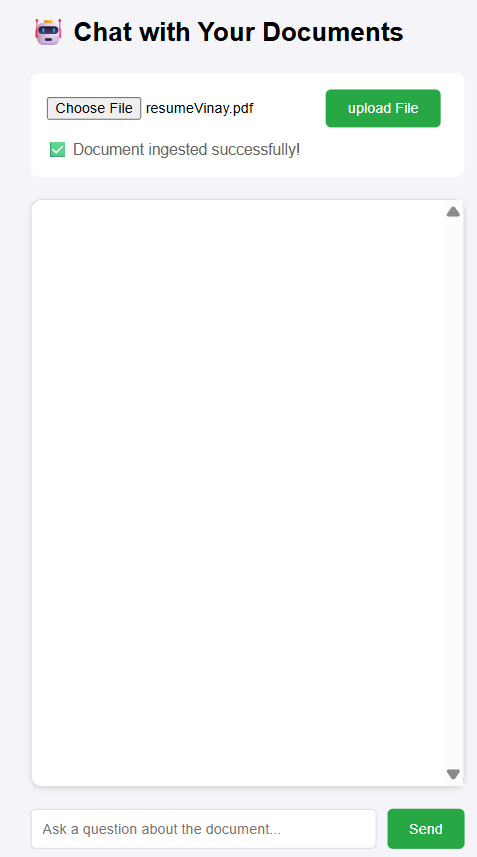
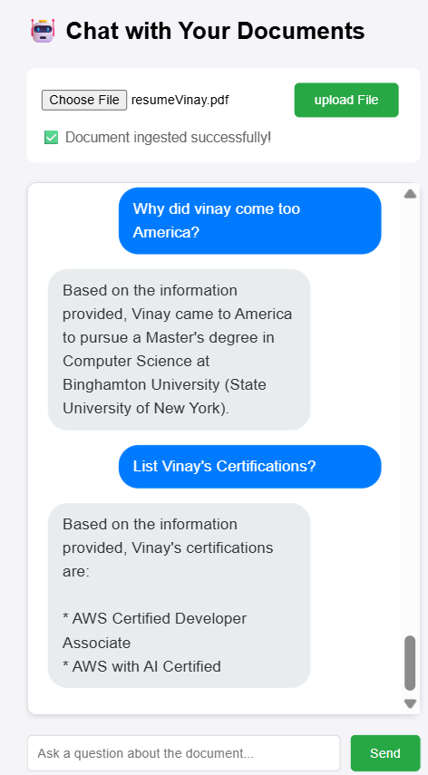

## 🚀 AI Document Assistant - Chat with Document


Welcome to **AI Document Assistant**!  
Chat with your PDFs and documents using the power of RAG and Gemini.

---

### 📝 Features

- 📄 Upload and ingest documents (PDF, text)
- 🤖 Ask questions and get instant answers from your docs
- 🔍 Uses Retrieval-Augmented Generation (RAG) for smart context

---

### 💡 How It Works

1. **Ingest your document**  
   

2. **Ask questions**  
   

3. **Get answers powered by AI!**

---

### 🛠️ Tech Stack

- Java + Spring Boot
- LangChain4j
- Gemini API
- PDFBox

---

### 📦 Getting Started

```sh
git clone https://github.com/vinaykumar2126/ai-document-assistant-java.git
cd ai-document-assistant-java
mvn spring-boot:run
```

---

**Enjoy chatting with your documents!**