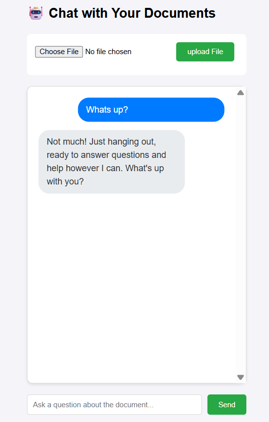
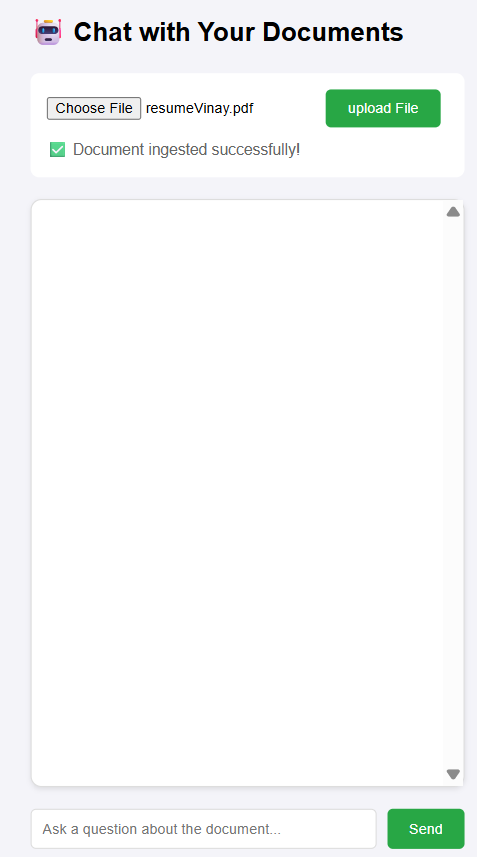
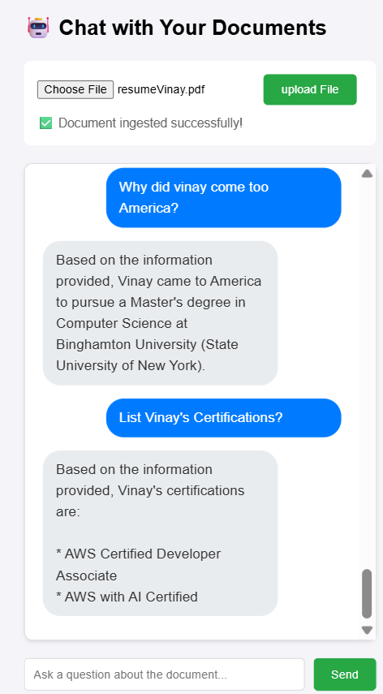

# AI Document Assistant

AI Document Assistant is a Spring Boot + React app for uploading documents, authenticating users, and chatting with document context through a RAG workflow.



## What it does

- Register and log in with username/password
- Optional Google OAuth login
- Upload `PDF`, `TXT`, and `DOCX` files
- Ask questions against uploaded content
- Run locally with a safe default H2 database
- Enable PostgreSQL, Gemini, and OAuth only when you want them

## Current UI

### Login


### Upload flow



### Chat flow



## Tech stack

- Backend: Spring Boot 3, Spring Security, Spring Data JPA
- Frontend: React, TypeScript, Vite
- AI/RAG: LangChain4j + Gemini
- Storage: H2 by default, PostgreSQL optional

## Project structure

```text
ai-document-assistant-java/
├── src/main/java/...          # Spring Boot backend
├── src/main/resources/        # backend config + static assets
├── frontend/                  # React + Vite frontend
└── pom.xml                    # Maven build
```

## Local startup

### Backend

The backend now starts locally without requiring PostgreSQL, Gemini, or OAuth credentials.

```bash
mvn spring-boot:run
```

Backend URLs:

- App: `http://localhost:8080`
- H2 console: `http://localhost:8080/h2-console`

Default local database settings:

- JDBC URL: `jdbc:h2:mem:aidb`
- Username: `sa`
- Password: empty

### Frontend

```bash
cd frontend
npm install
npm run dev
```

Frontend URL:

- `http://localhost:5173`

## Optional configuration

### Enable Gemini-powered document chat

Without a Gemini key, the app still starts, but AI ingestion/chat endpoints stay disabled.

```bash
export GEMINI_API_KEY=your_gemini_api_key
mvn spring-boot:run
```

### Enable PostgreSQL instead of H2

```bash
export SPRING_DATASOURCE_URL=jdbc:postgresql://localhost:5432/aidb
export SPRING_DATASOURCE_USERNAME=postgres
export SPRING_DATASOURCE_PASSWORD=your_password
mvn spring-boot:run
```

### Enable Google OAuth

Google OAuth config now lives in the `oauth` Spring profile.

```bash
export GOOGLE_CLIENT_ID=your_google_client_id
export GOOGLE_CLIENT_SECRET=your_google_client_secret
mvn spring-boot:run -Dspring-boot.run.profiles=oauth
```

## How to use the app from the UI

1. Start the backend.
2. Start the frontend.
3. Open `http://localhost:5173`.
4. Register a new account or sign in.
5. Upload a `PDF`, `TXT`, or `DOCX` file.
6. Ask questions in the chat panel.

## API interaction commands

### Register

```bash
curl -X POST http://localhost:8080/api/auth/register \
  -H "Content-Type: application/json" \
  -d '{
    "username": "demo",
    "email": "demo@example.com",
    "password": "secret123"
  }'
```

### Login

```bash
curl -X POST http://localhost:8080/api/auth/login \
  -H "Content-Type: application/json" \
  -d '{
    "username": "demo",
    "password": "secret123"
  }'
```

The response returns a JWT token. Save it and use it for protected endpoints:

```bash
export TOKEN="paste-jwt-here"
```

### Upload a document

```bash
curl -X POST http://localhost:8080/api/ai/ingest/upload \
  -H "Authorization: Bearer $TOKEN" \
  -F "file=@/absolute/path/to/your-document.pdf"
```

### Ask a question

```bash
curl "http://localhost:8080/api/ai/ask?question=Summarize%20the%20document" \
  -H "Authorization: Bearer $TOKEN"
```

## Notes

- `JWT_SECRET` now has a local default so development startup does not fail.
- H2 is the default datasource for local development.
- AI routes require `GEMINI_API_KEY`.
- Google OAuth requires the `oauth` profile plus Google client credentials.

## Verification

These checks passed after the current fixes:

```bash
mvn -Dtest=AiPoweredDocumentApplicationTests test
mvn spring-boot:run
```

## Supported file types

- `.pdf`
- `.txt`
- `.docx`
